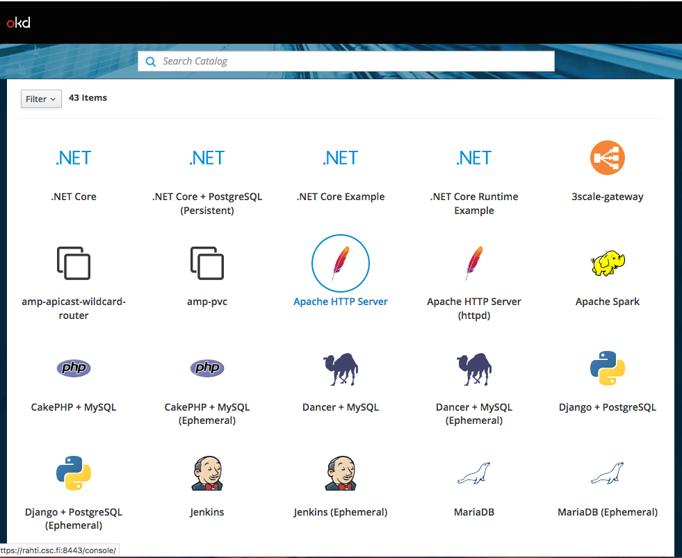
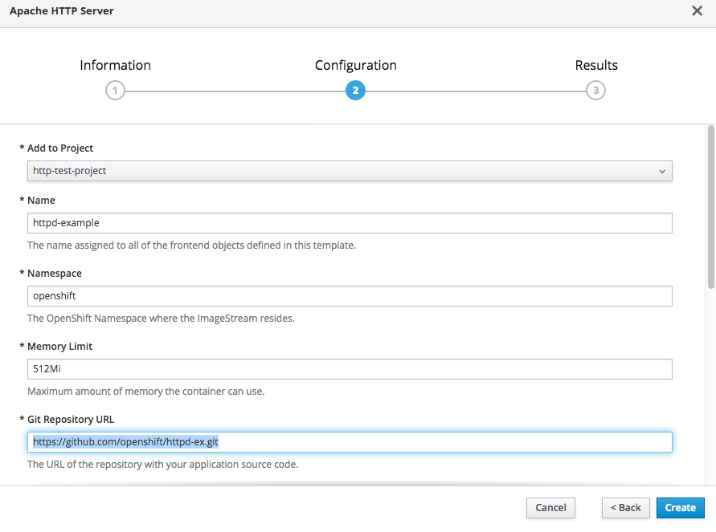
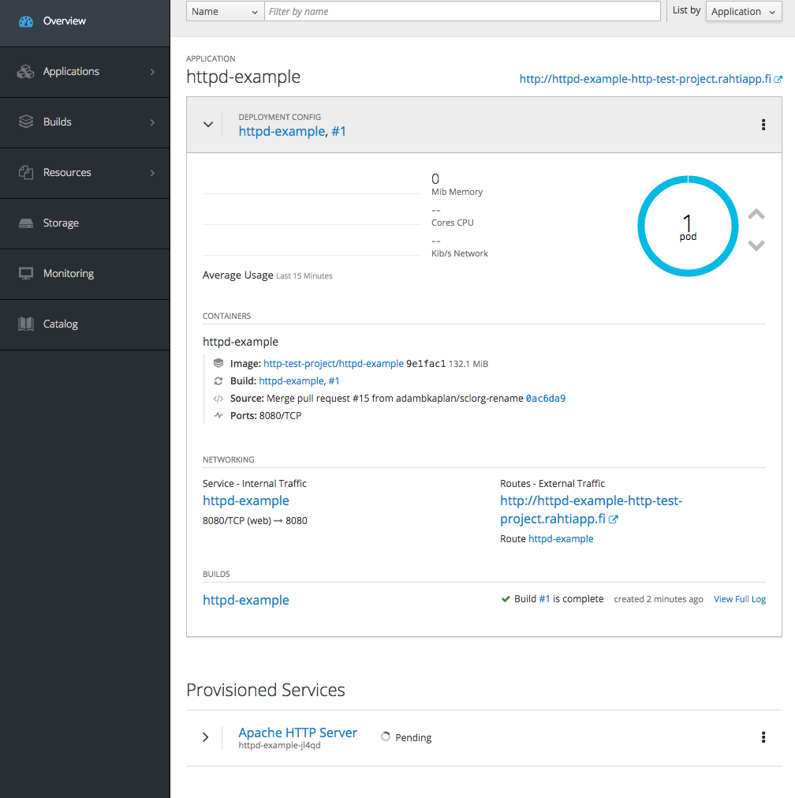

# Static web server with web console

This tutorial guides you to set up a static http server in rahti.

1. Create project, for instructions go to [Projects and quota](/usage/projects_and_quota/#projects_and_quota)
2. On the catalog screen, select "Apache HTTP Server"
   
3. Type in the source git repository containing the content to be served. Here, the sample content is used and the application is created in the "http-test-project".
   
4. Click create then navigate to the newly created project 
5. Now you should see the OpenShift dashboard displaying information about the application. 
    * This application is available at http://httpd-example-http-test-project.rahtiapp.fi.
   

What happened here was that OpenShift processed a template that provisioned various objects, such as *Pods*, *Services*, *Routes*, *DeploymentConfigs*, and *Builds* in to the container cloud and as a result a http server emerges.

For deeper insight in to the created objects, please see

* [Core objects](elemental_tutorial) for introduction to fundamental objects on which Kubernetes applications are built upon.
* [Utility objects](advanced_tutorial) for OpenShift extensions to Kubernetes to see how managing applications in OpenShift can be streamlined.
