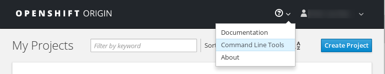

Rahti can be used via the command line either with OpenShift's oc tool or with
the kubectl tool from Kubernetes. Certain features specific to OpenShift are
only available when using the oc tool.

## The "Command Line Tools" page in the OpenShift web UI

The information for downloading the oc tool and logging in from the command line
can be found in the "Command Line Tools" page in the web interface. After
logging in to the web interface, you can find the page here:

The oc tool is a single binary that just needs to be placed in your path.
