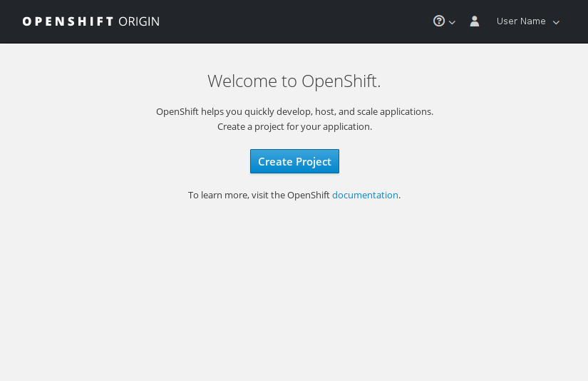
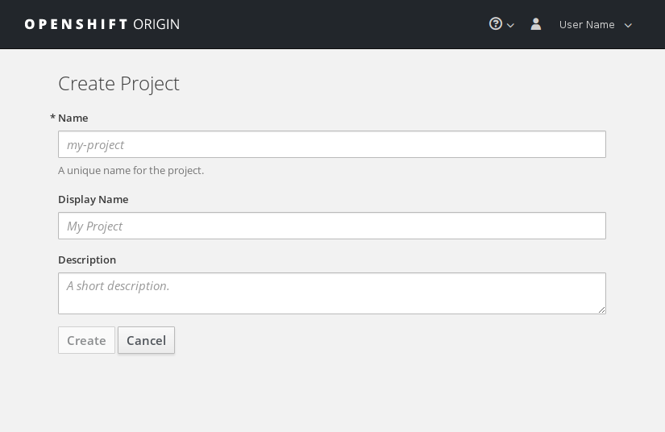

## Using the web interface

\if{LDAP_LOGIN_SUPPORT}
!!! note
    Projects in OpenShift are separate from CSC computing projects. A single CSC
    computing project can have access to multiple projects in OpenShift.
    Each CSC computing project with access to \env{SYSTEM_NAME} gets a *group* in
    OpenShift.
\endif

You can login at \env{OSO_WEB_UI_URL} (see [Getting access](../introduction/access)
for instructions). After logging in, you should see a page like this:

Click the blue "Create Project" button to create a project and you will be
presented with this view:

Here you'll need to pick a unique name that is not in use by any other project
in the system. You can also enter a human readable display name and a
description for the project. Once you've filled in the fields, click "Create"
and you will see the application catalog where you can pick from various
application templates or import your own.

For more information about using the web user interface, you can refer to the
[official OpenShift documentation](https://docs.openshift.org/). You can find
out which version of the documentation to look at in the web interface by
clicking the question mark symbol in the top bar and selecting "About".
